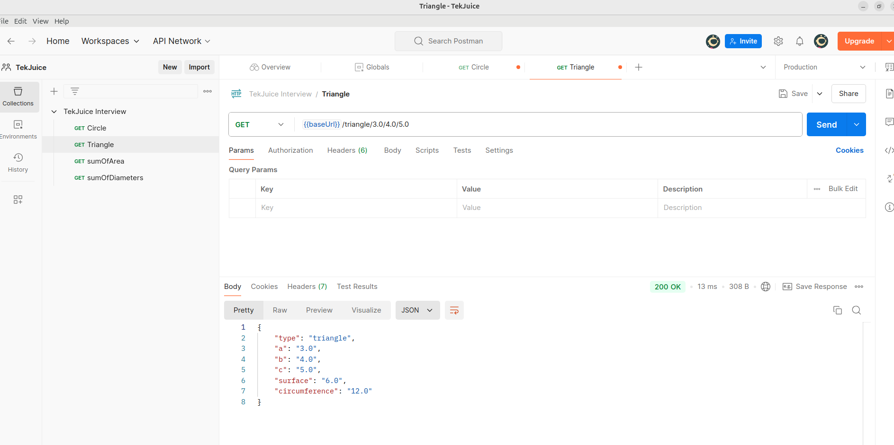

# Circle and Triangle API Documentation

Welcome to the Circle and Triangle API! This API allows users to calculate the surface area, circumference (diameter), and sum of areas and diameters for circles and triangles.

The API is built using the Symfony and is hosted locally on port 8000.


## Table of Contents

- [Base URL](#base-url)
- [Circle Endpoint](#circle-endpoint)
- [Triangle Endpoint](#triangle-endpoint)
- [Sum of Areas Endpoint](#sum-of-areas-endpoint)
- [Sum of Diameters Endpoint](#sum-of-diameters-endpoint)
- [Error Handling](#error-handling)

## Base URL

The base URL for accessing the API is:
http://127.0.0.1:8000/


## Circle Endpoint

### GET /circle/{radius}

This endpoint calculates the surface area and circumference of a circle given its radius.

#### Parameters

- **radius** (float): The radius of the circle.

#### Response

```json
{
    "type": "circle",
    "radius": 2.0,
    "surface": 12.56,
    "circumference": 12.56
}

```
## Triangle Endpoint
### GET /triangle/{a}/{b}/{c}
This endpoint calculates the surface area and circumference of a triangle given the lengths of its sides.

#### Parameters
- **a (float)** : Length of side A.
- **b (float)** : Length of side B.
- **c (float)** : Length of side C.
#### Response
```json
{
    "type": "triangle",
    "a": 3.0,
    "b": 4.0,
    "c": 5.0,
    "surface": 6.0,
    "circumference": 12.0
}
```
## Sum of Areas Endpoint
### GET /sum/areas?area1={area1}&area2={area2}
This endpoint calculates the sum of the areas of two Objects.
## Parameters
- **area1 (float)**: The first area to sum.
- **area2 (float)**: The second area to sum.
## Response
```json
{
    "sum_of_areas": 18.0
}
```
## Sum of Diameters Endpoint
### GET /sum/diameters?diameter1={diameter1}&diameter2={diameter2}
This endpoint calculates the sum of the diameters of two Objects.
## Parameters
- **diameter1 (float)**: The first diameter to sum.
- **diameter2 (float)**: The second diameter to sum.
## Response
```json
{
    "sum_of_diameters": 24.0
}
```

## Error Handling
In case of an error (e.g., invalid input or calculation failure), the API will return a JSON response with an appropriate status code and error message:
```json
{
  "error": "Both area1 and area2 must be provided"
}
```
